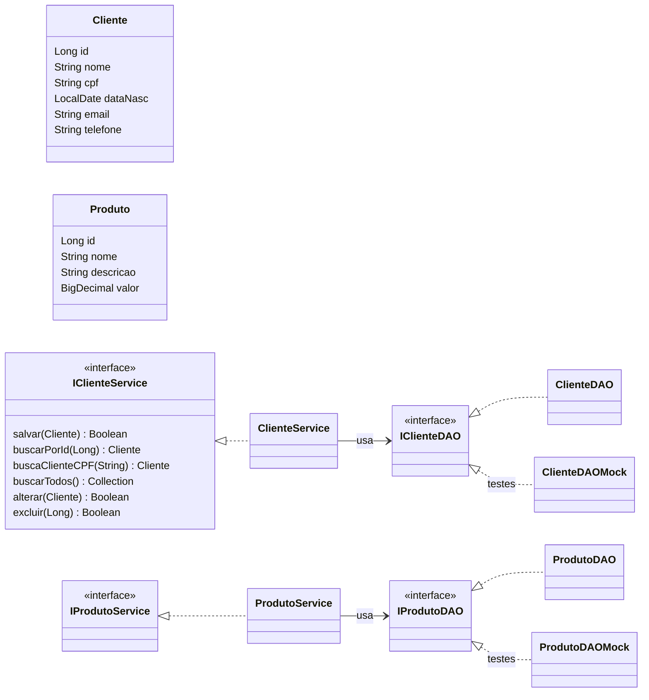

# 🛒 Cadastro de Clientes e Produtos


Projeto do **Módulo 25 da EBAC**: um CRUD completo de **clientes** e **produtos** em Java, organizado em camadas (domínio → DAO → service) e coberto por testes unitários com **JUnit 5** e **mocks**.

---

## ✨ Funcionalidades

| Operação | Cliente | Produto |
|---|:---:|:---:|
| Cadastrar | ✅ | ✅ |
| Buscar por id | ✅ | ✅ |
| Buscar por CPF | ✅ | — |
| Listar todos | ✅ | ✅ |
| Alterar | ✅ | ✅ |
| Excluir | ✅ | ✅ |

### Regras de negócio

- Não é possível cadastrar dois registros com o **mesmo id**.
- Cada cliente tem um **CPF único**, tanto ao cadastrar quanto ao alterar.
- Objetos `null` ou sem id são recusados com `IllegalArgumentException`.
- `salvar`, `alterar` e `excluir` retornam `true` quando dão certo e `false` quando não (ex.: id inexistente).

---

## 🧱 Arquitetura



- **Domínio** (`domain`): as entidades `Cliente` e `Produto`.
- **DAO** (`dao`): guarda os dados (por enquanto em memória).
- **Service** (`service`): aplica as regras de negócio e delega a persistência ao DAO.

O service recebe o DAO **pelo construtor**. Isso permite trocar o DAO real por um **mock** nos testes:

```java
IClienteService service = new ClienteService(new ClienteDAO());      // uso real
IClienteService teste   = new ClienteService(new ClienteDAOMock());  // nos testes
```

### Por que esses tipos?

- 💰 **`BigDecimal`** no valor do produto: evita erros de arredondamento com dinheiro (`0.1 + 0.2` dá exatamente `0.3`).
- 📅 **`LocalDate`** na data de nascimento: guarda só a data, sem horário.
- 📞 **`String`** no CPF e telefone: preserva zeros à esquerda.

---

## 📁 Estrutura

```
src
├── main/java/br/com/ebac
│   ├── domain/     Cliente, Produto
│   ├── dao/        IClienteDAO, ClienteDAO, IProdutoDAO, ProdutoDAO
│   └── service/    IClienteService, ClienteService, IProdutoService, ProdutoService
└── test/java/br/com/ebac
    ├── domain/     testes das entidades
    ├── dao/        testes dos DAOs + ClienteDAOMock, ProdutoDAOMock
    ├── service/    testes dos services usando os mocks
    └── crud/       testes de ponta a ponta (service + DAO reais)
```

---

## 🧪 Testes

| Camada | O que é testado | Testes |
|---|---|:---:|
| Domínio | construtores, getters/setters, `equals`/`hashCode`, `toString` | 20 |
| DAO | salvar, buscar, listar, alterar e excluir no DAO real | 29 |
| Service | regras de negócio isoladas com os **mocks** do DAO | 30 |
| CRUD | fluxo completo criar → ler → alterar → excluir | 14 |

Cada classe de teste usa `@BeforeEach` para preparar os dados e `@AfterEach` para limpar, garantindo que um teste não interfira no outro.

---

## 🚀 Como executar

**Pré-requisito:** JDK 17 ou superior. Não é preciso instalar o Maven, o projeto usa o **Maven Wrapper**.

```bash
# clonar
git clone https://github.com/gabedossa/mod_25_projeto_2.git
cd mod_25_projeto_2

# rodar os testes (Windows)
mvnw.cmd test

# rodar os testes (Linux / macOS)
./mvnw test
```

Resultado esperado:

```
[INFO] Tests run: 94, Failures: 0, Errors: 0, Skipped: 0
[INFO] BUILD SUCCESS
```

---

## 🛠️ Tecnologias

- Java 17
- JUnit 5 (Jupiter)
- Maven 3.9 (via Maven Wrapper)

---

## 🗺️ Próximos passos

- [ ] Entidade `Venda` ligando um cliente a uma lista de produtos
- [ ] Persistência em banco de dados
- [ ] Validação de formato de CPF e e-mail

---

Feito por **[Gabriel](https://github.com/gabedossa)** durante o curso de Java da **EBAC**.
